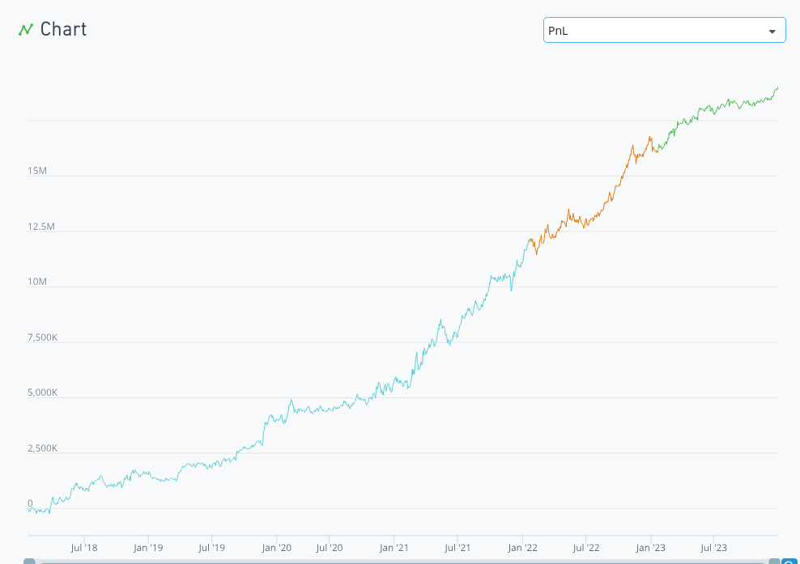

# Quant Alpha
The following are some of our submitted alphas in the International Quant Competition (IQC) 2025 held by WorldQuant.

## Alphas
```
e = 2.71828;
q = dividend;
S1 = (high - low);
S2 = ts_delay(S1, 2);
T = 250;
sigma = ts_std_dev(S1, T);
d1 = (log(S1/S2) + (q + sigma^2/2)*T/sigma*sqrt(T));
d2 = d1 - sigma*sqrt(T);
Margrabe = power(e, -q*T)*S1*rank(d1) - power(e, -q*T)*S2*rank(d2);
a = -group_backfill(scale(Margrabe), market, 20);

cp = power(1 + returns, 6) - 1;
jp = if_else(cp >= 1, 1, 0);

ts_decay_linear(trade_when(volume > ts_mean(volume, 22), a*jp, -1), 120)
```
| Region | Universe | Decay | Neutralization |
| ------ | -------- | ----- | -------------- |
| USA | TOP3000 | 120 | Industry |


